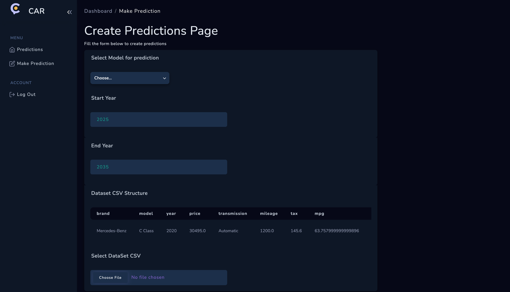

# AI Car Masters Project

This project focuses on developing and deploying a comprehensive predictive analytics framework for the automotive industry, utilizing machine learning and deep learning techniques. The primary objective is to create an accurate model for predicting car prices based on historical data.

The project culminates in the deployment of the best-performing models through a fully functional web application. This application features an intuitive user interface, a robust backend server, and a database to enable users to input a dataset with the specified vehicle attributes and receive real-time price predictions for viewing and download.

### Application images

#### Sign Up


#### Sign In


#### Dashboard


#### Make Predictions



#### Prediction Details


## Dependency Installation

```
yarn or npm install
```

## Start command

```
yarn dev or npm run dev
```

## Build command

```
yarn build or npm run build
```
